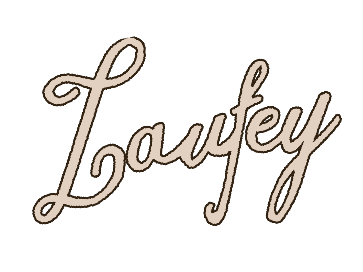

<a id="readme-top"></a>


<!-- PROJECT LOGO -->
<br />
<div align="center">
  <a href="https://github.com/vinc3w/LaufeyBot.git">
    
  </a>
  <h3 align="center">LaufeyBot</h3>
  <p align="center">Laufey music player!</p>
</div>


<!-- ABOUT THE PROJECT -->
## About LaufeyBot

![Laufey Banner][laufey-banner.png]

**LaufeyBot** is a simple and elegant Discord music bot built for fans of Laufey and her dreamy, jazz-inspired sound. Designed to bring a cozy and immersive listening experience into your server, LaufeyBot streams her music with intuitive controls.

Whether you're a long-time listener or new to Laufey's music, this bot is your go-to companion for setting the mood — one jazz chord at a time. 💚

<p align="right">(<a href="#readme-top">back to top</a>)</p>


<!-- FEATURES -->
## Features

- Plays Laufey's albums and tracks
- Queue, skip, pause, resume, loop
- User friendly commands
- Perfect for relaxing, studying with friends ✨

<p align="right">(<a href="#readme-top">back to top</a>)</p>


### Built With

All major frameworks/libraries used.

- [![Node][Node.js]][Node-url]
- [![TypeScript][TypeScript]][TypeScript-url]

<p align="right">(<a href="#readme-top">back to top</a>)</p>


<!-- GETTING STARTED -->
## Getting Started

To get a local copy up and running follow these simple example steps.

### Installation

Follow the steps below to install the project.

1. Clone the repo
   ```sh
   git clone https://github.com/vinc3w/LaufeyBot.git
   ```
2. Fill in the `.env` file in both server and client project
   ```env
   KEY=<Value>
   ```
3. Install NPM packages
   ```sh
   npm install
   ```
4. Run
   ```sh
   npm run dev
   ```

<p align="right">(<a href="#readme-top">back to top</a>)</p>


<!-- SCREENSHOTS EXAMPLES -->
## Screenshots

![Screenshot 1][screenshot-1.png]

<hr>

![Screenshot 2][screenshot-2.png]

<p align="right">(<a href="#readme-top">back to top</a>)</p>

<!-- CREDITS -->
## Credits
- [Saiteja Madha](https://github.com/saiteja-madha/discord-js-bot) - Referred for project structure

<p align="right">(<a href="#readme-top">back to top</a>)</p>


<!-- MARKDOWN LINKS & IMAGES -->
[logo.png]: assets/logo.png

[laufey-banner.png]: assets/laufey-banner.png
[screenshot-1.png]: assets/screenshots/1.png
[screenshot-2.png]: assets/screenshots/2.png

[Node.js]: https://img.shields.io/badge/Node.js-339933?style=flat&logo=node.js&logoColor=white
[Node-url]: https://nodejs.org/
[TypeScript]: https://img.shields.io/badge/TypeScript-3178C6?style=flat&logo=typescript&logoColor=white
[TypeScript-url]: https://www.typescriptlang.org/
